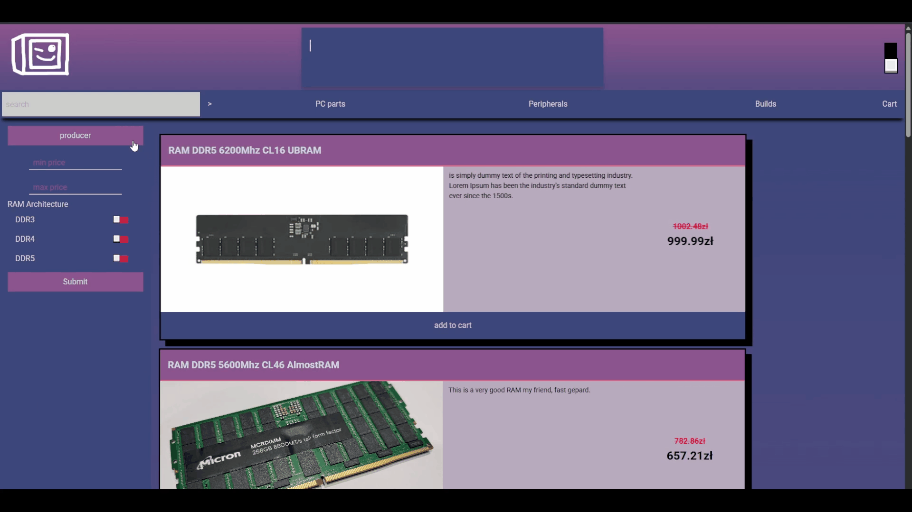

# Web Shop

Frontend web shop application that allows users to browse, filter, and purchase computer-related items.
The project focuses on **client-side filtering, search, pagination, and state management** with a mobile-friendly UI/UX.

---

## 🚀 Features
- Browse available computer-related items
- Dynamic filtering based on product specifications
- Search integrated with filtering logic
- Shopping cart (add, remove, persist across sessions)
- Custom toast notifications with stacking support
- Theme preference persistence
- Pagination for large lists of products
- Data fetched from API
- Mobile-friendly UI/UX

---

## 🛠️ Tech Stack
- React.js
- Vite
- TypeScript
- React Router
- SCSS

---

## 🏗️ Architecture Overview
- Built with React and TypeScript
- Client-side routing using React Router
- Global state management for cart and user preferences
- SCSS for styling and responsive design

---

## 🧠 Technical Implementation
- Dynamic filtering system based on product type and specifications
- Integrated search working alongside filters
- Persistent cart state using local storage
- Custom toast notifications for user feedback
- Reusable and typed React components
- Mobile-first design implemented with SCSS
- Pagination logic for efficient display of product lists

---

## 📸 Screenshots
<p align="center">
  <a href="screenshots/gifs/1.gif">
    
  </a>
  <a href="screenshots/gifs/2.gif">
    
  </a>
  <a href="screenshots/gifs/3.gif">
    
  </a>
</p>

More screenshots available in the `/screenshots` directory.

---

## ⚙️ How to Run the Application
1. Install dependencies:
   ```bash
   npm install
   ```

2. Run application
   ```bash
   npm run dev
   ```
